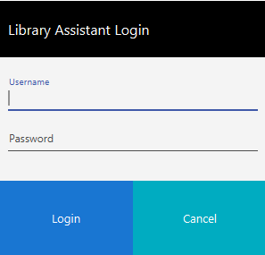
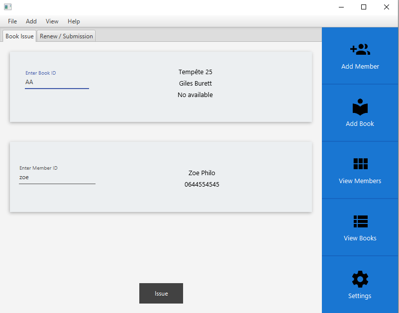
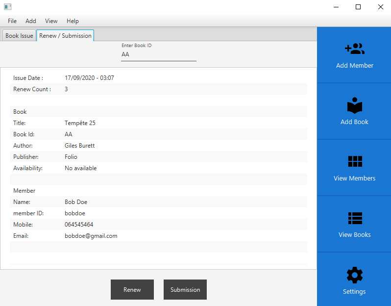
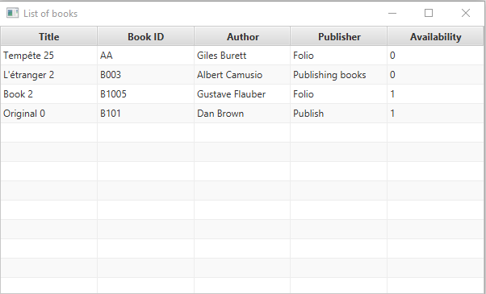
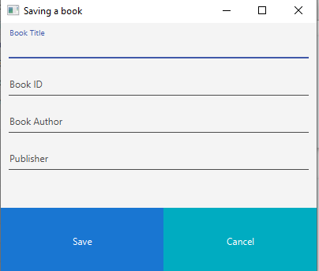
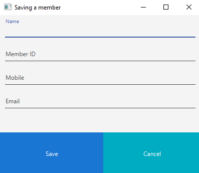
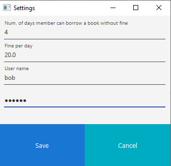

# Library management

JavaFx project with Java SE 11 and maven

To configure a javaFx project go to [openjfx.io](https://openjfx.io/openjfx-docs/#introduction)

## Project views

### Login Window

### Main window

### Renew submisssion window

### Listing members window

### Listing books window

### Add book window

### Add member window

### Settings window

